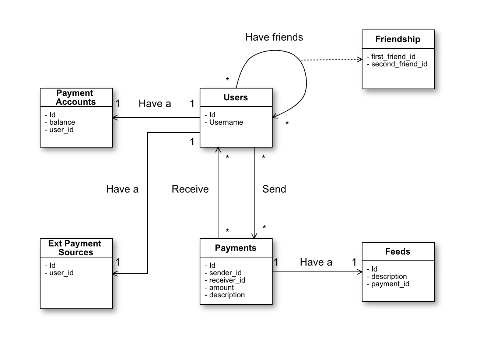

# Venmo Api

Venmo Api is a mobile payment service which allows friends to transfer money to each other. It also
has some social features like show your friends’ payment activities as feed. It's based on Rails 6 and Ruby 2.6.5.

## Features

This template comes with:
- Get the user balance
- Send payment to a friend
- Get feeds records

## How to use

1. Clone this repo
1. Install PostgreSQL in case you don't have it
1. Run `bootstrap.sh` with the name of your your project like `./bootstrap.sh my_awesome_project`
1. `rspec` and make sure all tests pass
1. `rails s`
1. You can now try your REST services!

## Gems

- [Annotate](https://github.com/ctran/annotate_models) for doc the schema in the classes
- [Better Errors](https://github.com/charliesome/better_errors) for a better error page
- [Brakeman](https://github.com/presidentbeef/brakeman) for static analysis security
- [Bullet](https://github.com/flyerhzm/bullet) help to kill N+1
- [Byebug](https://github.com/deivid-rodriguez/byebug) for debugging
- [DelayedJob](https://github.com/collectiveidea/delayed_job) for background processing
- [Dotenv](https://github.com/bkeepers/dotenv) for handling environment variables
- [Draper](https://github.com/drapergem/draper) for decorators
- [ExceptionHunter](https://github.com/rootstrap/exception_hunter) for exception tracking
- [Factory Bot](https://github.com/thoughtbot/factory_bot) for testing data
- [Faker](https://github.com/stympy/faker) for generating test data
- [Jbuilder](https://github.com/rails/jbuilder) for json views
- [Letter Opener](https://github.com/ryanb/letter_opener) for previewing a mail in the browser
- [Oj](https://github.com/ohler55/oj) for optimized json
- [Pry](https://github.com/pry/pry) for enhancing the ruby shell
- [Puma](https://github.com/puma/puma) for the server
- [Pundit](https://github.com/varvet/pundit) for authorization management
- [Rack CORS](https://github.com/cyu/rack-cors) for handling CORS
- [Rails Best Practices](https://github.com/flyerhzm/rails_best_practices) for rails linting
- [Reek](https://github.com/troessner/reek) for ruby linting
- [RSpec](https://github.com/rspec/rspec) for testing
- [Rspec API Doc Generator](https://github.com/zipmark/rspec_api_documentation) for API documentation
- [Rubocop](https://github.com/bbatsov/rubocop/) for ruby linting
- [Sendgrid](https://github.com/stephenb/sendgrid) for sending mails
- [Shoulda Matchers](https://github.com/thoughtbot/shoulda-matchers) adds other testing matchers
- [Simplecov](https://github.com/colszowka/simplecov) for code coverage
- [Webmock](https://github.com/bblimke/webmock) for stubbing http requests
- [YAAF](https://github.com/rootstrap/yaaf) for form objects

## Optional configuration

- Set your [frontend URL](https://github.com/cyu/rack-cors#origin) in `config/initializers/rack_cors.rb`
- Set your mail sender in `config/initializers/devise.rb`
- Config your timezone accordingly in `application.rb`.

## Api Docs

https://railsapibasers.docs.apiary.io/

With [Rspec API Doc Generator](https://github.com/zipmark/rspec_api_documentation) you can generate the docs after writing the acceptance specs.

Just run:

`./bin/docs `

An `apiary.apib` file will be generated at the root directory of the project.

## Code quality

With `rake code_analysis` you can run the code analysis tool, you can omit rules with:

- [Rubocop](https://github.com/bbatsov/rubocop/blob/master/config/default.yml) Edit `.rubocop.yml`
- [Reek](https://github.com/troessner/reek#configuration-file) Edit `config.reek`
- [Rails Best Practices](https://github.com/flyerhzm/rails_best_practices#custom-configuration) Edit `config/rails_best_practices.yml`
- [Brakeman](https://github.com/presidentbeef/brakeman) Run `brakeman -I` to generate `config/brakeman.ignore`
- [Bullet](https://github.com/flyerhzm/bullet#whitelist) You can add exceptions to a bullet initializer or in the controller

## Configuring Code Climate
1. After adding the project to CC, go to `Repo Settings`
1. On the `Test Coverage` tab, copy the `Test Reporter ID`
1. Set the current value of `CC_TEST_REPORTER_ID` in the [circle-ci project env variables](https://circleci.com/docs/2.0/env-vars/#setting-an-environment-variable-in-a-project)

## Entity Relationship Diagram

* Friendship concept was handled as a bidirectional association (e.g user_a and user_b friendship will be represented as only one Friendship table entry, whether user_a or user_b value is on first_friend or second_friend attribute will be exactly the same for the system.)

## Api Docs

## Services

This project has 3 main services.

* PaymentService handles the logic for creating a payment between two users. First it will validate that the receiver user is friend of the sender user and if the amount of money is a positive value, displaying the respective error message in case of failure. Then it will validate that the sender user's balance is equal or greater than the amount to transfer, if it's not it will proceed to call the service explained below. Finally if validations passed, a payment and a feed will be created.

* Money Transfer Service mocks an external payment source connection which is called whenever a user tries to transfer an amount greater than his account's balance. The service will act as a successful request to an external party and will add the required value for the user to make the transfer.

* FeedService will return all the payments that a given user should see on their feed. Such collection will be composed by his own payments plus his friends payments.

## Code Owners

You can use [CODEOWNERS](https://help.github.com/en/articles/about-code-owners) file to define individuals or teams that are responsible for code in the repository.

Code owners are automatically requested for review when someone opens a pull request that modifies code that they own.

## Credits

Rails Api Base is maintained by [Rootstrap](http://www.rootstrap.com) with the help of our
[contributors](https://github.com/rootstrap/rails_api_base/contributors).

